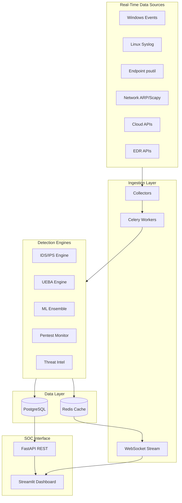

# Sentinel-AI XDR Architecture

## Overview

Sentinel-AI XDR is an enterprise Extended Detection and Response platform combining SIEM, UEBA, IDS/IPS, Threat Intelligence, and SOC operations.

## Components

| Layer | Technology | Purpose |
|-------|------------|---------|
| API | FastAPI | REST, JWT, RBAC, WebSockets |
| Database | PostgreSQL | Users, alerts, events, assets, IOCs |
| Cache | Redis | Sessions, IOC cache, pub/sub, rate limits |
| Workers | Celery | Real-time collection every 30s |
| ML | scikit-learn, XGBoost, PyTorch | 6-model ensemble |
| Dashboard | Streamlit, Plotly, PyVis | 20 SOC modules |
| Deploy | Docker Compose, Nginx | Production stack |

## Data Flow

1. **Collectors** gather live data from the host OS, network interfaces, and configured APIs
2. **Event Pipeline** normalizes events into `security_events` table
3. **Detection Engines** analyze and create alerts with MITRE mapping
4. **Redis** publishes real-time updates to WebSocket subscribers
5. **Dashboard** polls API and auto-refreshes every 10-60 seconds

## Security Controls

- RBAC with 7 roles
- MFA (TOTP)
- JWT session management
- IPS prevention requires approval
- Network discovery audit logging
- Asset approval workflow

## Database Schema

See `docs/DATABASE_SCHEMA.md`

## Redis Design

See `backend/app/core/redis_cache.py` for key patterns
